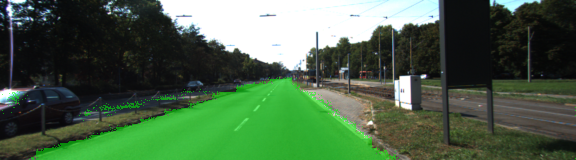
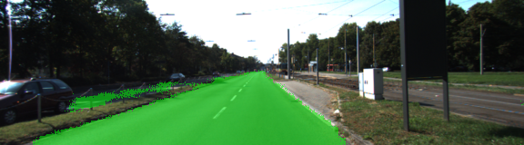
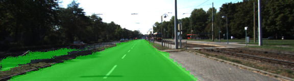
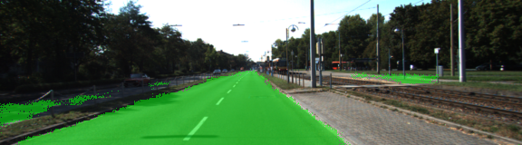
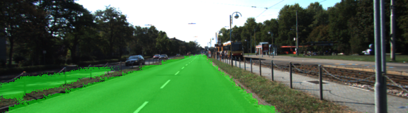
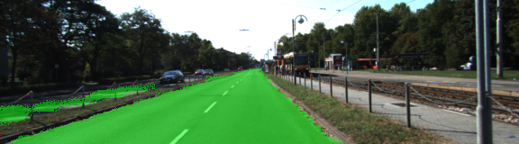
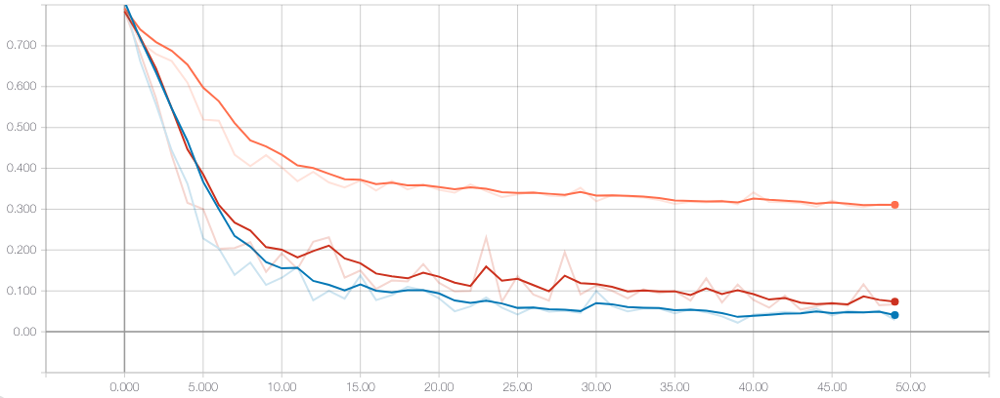

# Semantic Segmentation
### Introduction
In this project, you'll label the pixels of a road in images using a Fully Convolutional Network (FCN).

### Output


### Implementation

The code structure is as below:

1. [main.py](./main.py)
2. [helper.py](./helper.py)
3. [project_tests.py](./project_tests.py)

The above files are pre-implemented except main.py.

The `main.py` consists of the main network. The following changes were made in `main.py`:

1. The `load_vgg` [line 21](./main.py#L21) downloads the VGG16 model if not available in the data directory.
2. As suggested the layer 3, layer 4 and layer 7 are extracted from the model. In addition, the input and keep probability are also extracted.
3. The convolution layer `conv_1x1_vgg_layer_7` [line 65](./main.py#L65) with a kernel 1 is created.
4. First deconvolution layer `first_upsample_deconv_x2` [line 74](./main.py#L74) with a kernel 4 is created using a stride of 2 from the convolution layer `conv_1x1_vgg_layer_7`.
5. The second convolution layer `conv_1x1_vgg_layer_4` [line 84](./main.py#L84) with a kernel 1 is created.
6. The above two layers were used to create first skip layer [line 93](./main.py#L93)
7. The second deconvolution layer `second_upsample_deconv_x2` with kernel 4 is created using a stride of 2 from the convolution layer `conv_1x1_vgg_layer_4` [line 96](./main.py#L96)
8. The third convolution layer `conv_1x1_vgg_layer_3` [line 106](./main.py#L106) with a kernel 1 is created.
9. The above two layers are used to create second skip layer [line 115](./main.py#L115).


**Training configuration**
The training of the network has following configuration:

1. The convolution and deconvolution layers are created using a random normal kernel initializer with SD of `0.01` and L2 kernel regularizer with `0.001`.
2. I have used Adam Optimizer with uses cross entropy minimization. Since the adam optimizer uses learning decay, thus, its better choice over stochastic gradient descent. The learning rate is `0.00001`.
3. The dropout layer keep probablity is set to `0.5`.


**Image augmentation**

I used the image augmentation library `imgaug`. I modified the `helper.py` file at line to augment the image files [line 69](./helper.py#L69). I used the random flip `iaa.Fliplr(0.5)` and converted the images to HSV `iaa.AddToHueAndSaturation((-10, 10),per_channel=True)`.

The comparison of performance of the network with different epochs are as below:

I tried the network with different configurations and augmentations using imgaug library. I ran the network for epoch values 6, 25, 50, 75 and 100. I found 50 to be the most optimal.

| Epoch 50 without aug | Epoch 50 with aug |
| ------------- |:-------------:|
| | |
| | |
| | |



The training with different configurations showed the above results w.r.t training loss minimization.

<p>
<span style="color:orange">
* The orange line is with stochastic gradient descent without learning decay. It shows lots of overfitting.
</span></p>

<p>
<span style="color:red">
* The red line is training using images without augmentation.</span></p>

<p>
<span style="color:blue">
* The blue line is training using images with augmentation.</span></p>

`The blue line graph is the output of the final network`.

**Please Note: The helper.py will require imgaug package to be installed.
To install imgaug please use the instructions at:**

[imgaug installation](https://imgaug.readthedocs.io/en/latest/source/installation.html#install-requirements)


### Setup
##### GPU
`main.py` will check to make sure you are using GPU - if you don't have a GPU on your system, you can use AWS or another cloud computing platform.
##### Frameworks and Packages
Make sure you have the following is installed:
 - [Python 3](https://www.python.org/)
 - [TensorFlow](https://www.tensorflow.org/)
 - [NumPy](http://www.numpy.org/)
 - [SciPy](https://www.scipy.org/)
##### Dataset
Download the [Kitti Road dataset](http://www.cvlibs.net/datasets/kitti/eval_road.php) from [here](http://www.cvlibs.net/download.php?file=data_road.zip).  Extract the dataset in the `data` folder.  This will create the folder `data_road` with all the training a test images.

### Start
##### Implement
Implement the code in the `main.py` module indicated by the "TODO" comments.
The comments indicated with "OPTIONAL" tag are not required to complete.
##### Run
Run the following command to run the project:
```
python main.py
```
**Note** If running this in Jupyter Notebook system messages, such as those regarding test status, may appear in the terminal rather than the notebook.

### Submission
1. Ensure you've passed all the unit tests.
2. Ensure you pass all points on [the rubric](https://review.udacity.com/#!/rubrics/989/view).
3. Submit the following in a zip file.
 - `helper.py`
 - `main.py`
 - `project_tests.py`
 - Newest inference images from `runs` folder  (**all images from the most recent run**)
 
 ### Tips
- The link for the frozen `VGG16` model is hardcoded into `helper.py`.  The model can be found [here](https://s3-us-west-1.amazonaws.com/udacity-selfdrivingcar/vgg.zip).
- The model is not vanilla `VGG16`, but a fully convolutional version, which already contains the 1x1 convolutions to replace the fully connected layers. Please see this [post](https://s3-us-west-1.amazonaws.com/udacity-selfdrivingcar/forum_archive/Semantic_Segmentation_advice.pdf) for more information.  A summary of additional points, follow. 
- The original FCN-8s was trained in stages. The authors later uploaded a version that was trained all at once to their GitHub repo.  The version in the GitHub repo has one important difference: The outputs of pooling layers 3 and 4 are scaled before they are fed into the 1x1 convolutions.  As a result, some students have found that the model learns much better with the scaling layers included. The model may not converge substantially faster, but may reach a higher IoU and accuracy. 
- When adding l2-regularization, setting a regularizer in the arguments of the `tf.layers` is not enough. Regularization loss terms must be manually added to your loss function. otherwise regularization is not implemented.
 
### Using GitHub and Creating Effective READMEs
If you are unfamiliar with GitHub , Udacity has a brief [GitHub tutorial](http://blog.udacity.com/2015/06/a-beginners-git-github-tutorial.html) to get you started. Udacity also provides a more detailed free [course on git and GitHub](https://www.udacity.com/course/how-to-use-git-and-github--ud775).

To learn about REAMDE files and Markdown, Udacity provides a free [course on READMEs](https://www.udacity.com/courses/ud777), as well. 

GitHub also provides a [tutorial](https://guides.github.com/features/mastering-markdown/) about creating Markdown files.
